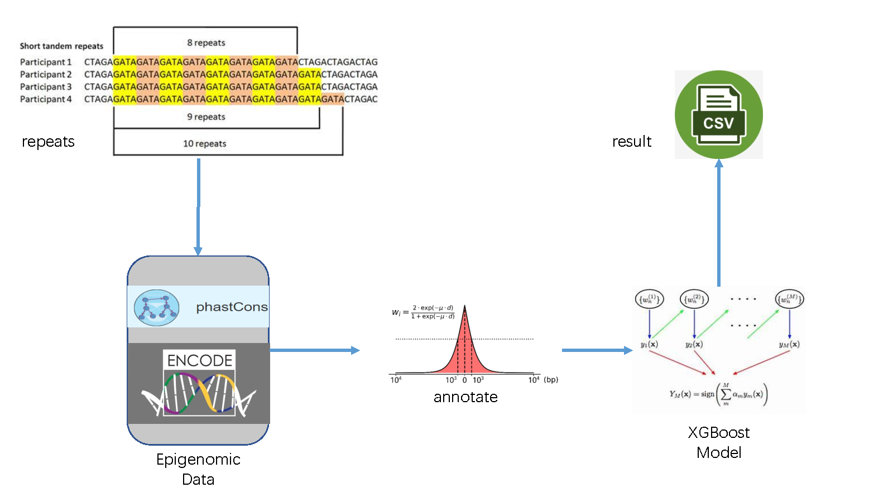

# Characterizing the genomic regions with repeat expansions
The epigenetics data, including CTCF binding sites, DNase-seq and histone modification data, were obtained from the [ENCODE project](https://www.encodeproject.org/). Accession IDs are: ENCFF618DDO (CTCF ChIP-seq, narrowPeak); ENCFF021YPR (H3K27me3 ChIP-seq, bigWig); ENCFF388WCD (H3K36me3 ChIP-seq, bigWig); ENCFF481BLF (H3K4me1 ChIP-seq, bigWig); ENCFF780JKM (H3K3me3 ChIP-seq, bigWig); ENCFF411VJD (H3K9me3 ChIP-seq, bigWig).

phastCons conservation scores were downloaded from [UCSC](https://hgdownload.cse.ucsc.edu/goldenpath/hg19/phastCons100way/hg19.100way.phastCons.bw).

The pre-computed MMSplice scores were obtained from the annotation of [CADD (offline version)](https://cadd.gs.washington.edu/download).

Non-B DNA structure annotation (hg19): https://ncifrederick.cancer.gov/bids/ftp/?non\#, https://ncifrederick.cancer.gov/bids/ftp/actions/download/?resource=/bioinfo/static/nonb_dwnld/human_hg19/human_hg19.gff.tar.gz.

The file named “hg19.rloop.filtered.mergedRegion.bed” for Rloop annotation is from the publication of Piroon Jenjaroenpun et.al., “R-loopDB: a database for R-loop forming sequences (RLFS) and R-loops” (PMID: 27899586)

The DNA repair binding signal intensity files (the four .bw files) for [BER annotation](https://de.cyverse.org/data/ds/iplant/home/abacolla/bigwig?selectedOrder=asc&selectedOrderBy=name&selectedPage=0&selectedRowsPerPage=100)

# DPREx
DPREx is a machine-learning based tool to discriminate potential genes intervals to be pathogenic in which repeats mutation happens.

## How does the model work?
First, we use comprehensive epigenetic data which include chromatin accessibility, histone modification marks, the binding strength of TFs, distance to alternative splicing, non-B DNA structure, Rloop structure coverage fraction, free energy of pre-RNA, mean pairing probability of pre-RNA, and the binding strength of base excision repair (BER) pathway DNA glycosylases  to annotate the intervals of input repeats.

Then, a pre-trained XGBoost based model is loaded to predict the annotated table. This model uses features dominantly come from repeat interval annotation, and doesn't care about the detail length of the interval , making its prediction mainly based on gene expression and regulation, instead of pattern of mutations.

## How to use
1. prepare for the environment
    * make sure the python's version is not less than 3.8.
    * use virtualenv to create a new environment (optional but recommended).
    * type in: pip3 install -r requirement.txt, make sure you are in the same path of this project.
2. Installation of external software and placement of data-files
    *  bedtools should be installed for sequence-relation options. Change the term of “bedtools” in fan_path2.json to the real installation path of bedtools.
    *  The RNAfold module of ViennaRNA (version 2.4.4) was used to calculate the free energy of 100bp upstream of the start and downstream of the end of the pre-RNA fragment corresponding to the submitted DNA fragment. For those without root privilege, to install ViennaRNA for RNAfold running, just download the install package of “ViennaRNA-2.4.4.tar.gz” to the path you plan to install softwares (`<path for softwares>`). Then run: 
		* `cd <path for softwares>`
		* `mkdir RNAfold_install`
		* `mkdir RNAfold_data`
		* `tar zxvf ViennaRNA-2.4.4.tar.gz1`
		* `cd ViennaRNA-2.4.4`
		* `../configure –prefix=`<path for softwares>`/RNAfold_install –datadir=`<path for 	softwares>`/RNAfold_data`
		* `make`
		* `make install`
	* After above steps, the executive script of RNAfold is in the path of `<path for softwares>`/RNAfold_install/bin/RNAfold. Change the “run_Rfold” in fan_path2.json to the real installation path of the executive scripts of RNAfold.

    * The TH-GRASS software was used to calculated the mean pairing probability of 100bp upstream of the start and downstream of the end of the pre-RNA fragment corresponding to the submitted DNA fragment. The code is in the [github]( https://github.com/yuedongyang/GRASP ). We suggest that you install TH-GRASS via conda. For example: 
	`conda create tf-grass_env python=3.6`

	* Here note that python3.6 is necessary for a successful installation. Then go on with: 
		* `conda activate tf-grass_env`
		* `pip3 install -r requirments.txt`
	* After that, TF-GRASS is available for use. Change the term of “dir_GF” in fan_path2.json to the real installation path of TH-GRASS, which contain files like the train.py, test.py, and utils.py. Change the term of “conda_python3” in fan_path2.json to the real path of executive python3.6 of the conda environment of tf-grass.
    * Download the hg19 reference gnome file in the format of fasta, as well as the corresponding .fa.fai files, put them into the same path, and then change  the “hg19_in” in fan_path2.json to the real path that contain the fasta as well as the .fa.fai files.
    * Download the file named “hg19.rloop.filtered.mergedRegion.bed” supplied by us, and then change  the “dir_rloop_annot” in fan_path2.json to the real path that contain the file of “hg19.rloop.filtered.mergedRegion.bed”.
    * Download the four files separately named “ACNEIL_SSINP_2_hg19_FE.bw”, “GSM2137770_POLB_hg19.bw”, “ogg1_hg19.bw” and “xrcc1_hg19.bw”. Then change the “dir_BER_annot” in fan_path2.json to the real path that contain the four .bw files.

3. set epigenetic data resources in manifest.txt.
    * It should contain your sample file and epigenetic data file (in various formats can be found in the sample.).
    * If you want to add new property, add new line following.
    * To remove property, use '%' to comment out that line.
4. set configuration in config.json.
5. organise your input file in BED3 format.
6. invoke the command line API: 
`python main.py path-to-input/input.bed -o save_dir/`

## Calculation procedure

the coverage fraction of R_loop and DNA-repair factors binding region was calculated by comparing the location of submitted DNA fragments and the location of annotated regions of R_loop or DNA-repair factors binding region. The coverage fraction was defined as the bp length of  overlapped region, divided by the bp length of the submitted fragment.

the pairing probability and free energy were calculated beginning from the primary RNA sequence of the submitted DNA fragment, which was gained with the help of bedtools and RNA fold module of  Vienna RNA software. Related files were stored in the path of <dir_gen_files>/new_bed and  <dir_gen_files>/get_seq, which would be deleted after pipline calculation finished. Note here by “<dir_gen_files>” we mean the parameter you filled in after the option of –dir_gen_files in the file of fan_path2.json.

begin from the RNA sequence, the pairing probability of each residue of the RNA fragment was calculated by the TH-GRASS software. Then the mean of the residues’ pairing probability was calculated as the “RNA_pair” feature. “st_pair” is the mean pairing probability of 100bp upstream of the start of submitted RNA fragment, while “ed_pair” is the mean pairing probability of 100bp downstream of the end of submitted RNA fragment. Related files were stored in the path of <dir_gen_files>/RNA_pair/, which would be deleted after pipline calculation finished.

begin from the RNA sequence, the free energy of the RNA fragment was calculated by the RNAfold module of viennaRNA software.  “st_energy” is the free energy of 100bp upstream of the start of submitted RNA fragment, while “ed_energy” is the free energy of 100bp downstream of the end of submitted RNA fragment. Related files were stored in the path of <dir_gen_files>/RNA_free_energy/, which would be deleted after pipeline calculation finished.
## Acknowledgment
The file named “hg19.rloop.filtered.mergedRegion.bed” for rloop annotation is from the publication of Piroon Jenjaroenpun et.al., “R-loopDB: a database for R-loop forming sequences (RLFS) and R-loops” (PMID: 27899586)

The DNA repair binding signal intensity files (.bw files) for BER annotation is from the website of  https://de.cyverse.org/data/ds/iplant/home/abacolla/bigwig?selectedOrder=asc&selectedOrderBy=name&selectedPage=0&selectedRowsPerPage=100

## parameter
* input [positional] : the path of input BED6 file
* --output [-o] : the path to store the result csv
* --help <-h> : for help

## input file
The input file should be organised following the BED6 format, the columns are: 
chromosome start end 
seperated with tab

Here are some examples: 
chr1 12252260 12252264 
chr3 187388896 187388910 
chr4 1019055 1019075

## result file
* The result will be saved in a CSV file, with columns called repeats_id, probability_score and pathogenic. 
* For a record like "chr1 12252260 12252264", its repeats_id is "chr1@12252260@12252264". 
* The order of the records can be different from the input file, but it can be re-sorted with repeats_id.
* The pathogenic column denotes whether a mutation is pathogenic if it happens in the repeat interval, the
probability_score is positively related to that likelihood.
